<p align="center">
  <a src='https://www.onesaitplatform.com/'>
    
  </a>
</p>
 
## OneLog project 
OneLog project is a centralized logging project using Graylog. Every module and service from Onesait Platform will store their logs into Graylog using a custom GELF TCP appender.

<p align="center">
    
</p>

## Graylog

To start up graylog, the best way it is using Docker with a [docker-compose file](https://github.com/onesaitplatform/onesaitplatform-revolution-onelog/blob/master/devops/build-deploy/docker/graylog/docker-compose.yml). Inside of the docker-compose file folder, use the following command:

```
  docker-compose up
```

After a while, you should be able to login in the Graylog dashboard using the [http://127.0.0.1:9000/](http://127.0.0.1:9000/).

<p align="center">
  <a src='https://www.onesaitplatform.com/'>
    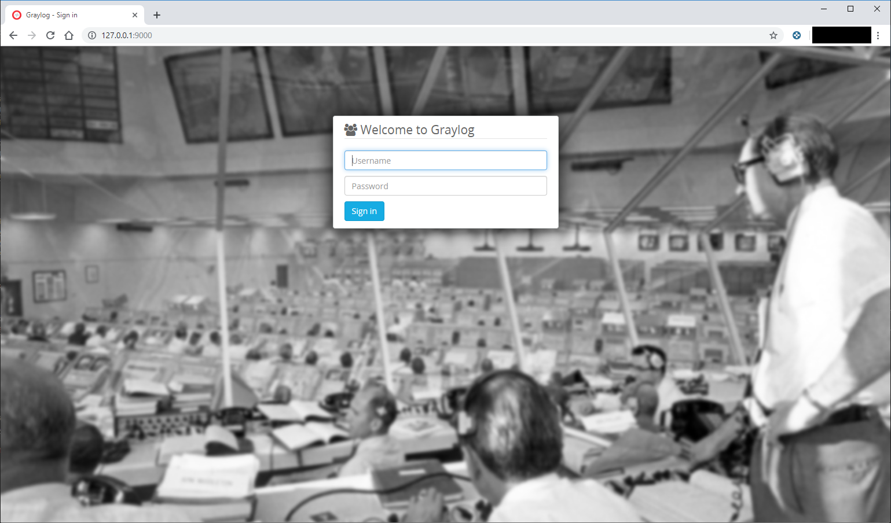
  </a>
</p>

The default user is **admin** with the password **admin**. You should change the default password in the user profile settings.

### Enable GELF TCP Input

The first step should be to enable the **GELF TCP input**, to be able to send logs from Onesait Platform modules. 
<p align="center">
  <a src='https://www.onesaitplatform.com/'>
    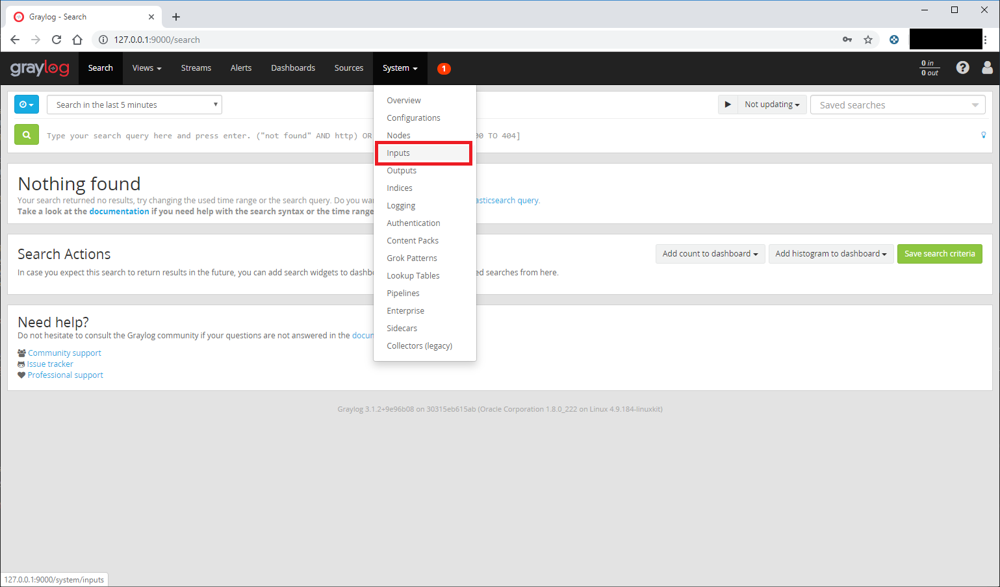
  </a>
</p>

Select **System** > **Inputs**.

<p align="center">
  <a src='https://www.onesaitplatform.com/'>
    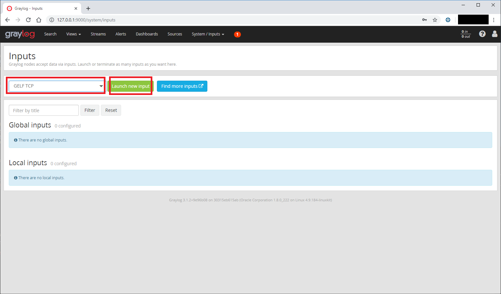
  </a>
</p>

In the combo selector, choose **GELF TCP** and press the button **Launch new input**.

<p align="center">
  <a src='https://www.onesaitplatform.com/'>
    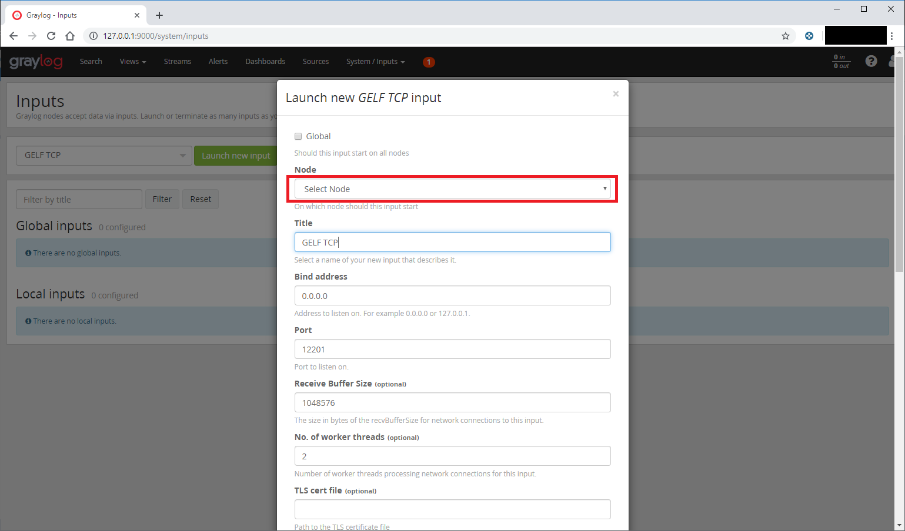
  </a>
</p>

In the new modal window, **select the node** and enter the new **input title**. Then, scroll down and press the **Save** button.

<p align="center">
  <a src='https://www.onesaitplatform.com/'>
    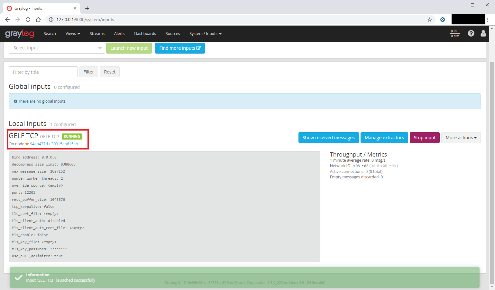
  </a>
</p>

The new GELF TCP input should now be up and running properly.

### Streams

A stream it is a way to filter messages from an application, service or custom filter.

<p align="center">
  <a src='https://www.onesaitplatform.com/'>
    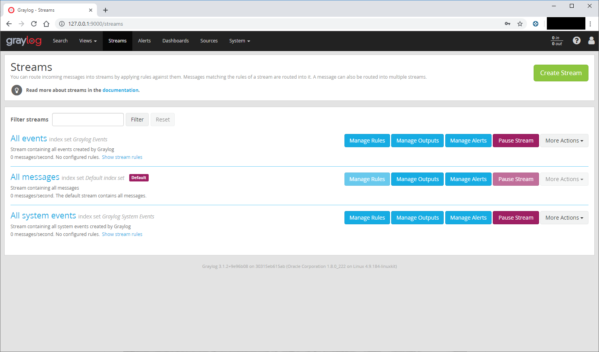
  </a>
</p>

By default, you can see all the messages using the filter **All messages**.

<p align="center">
  <a src='https://www.onesaitplatform.com/'>
    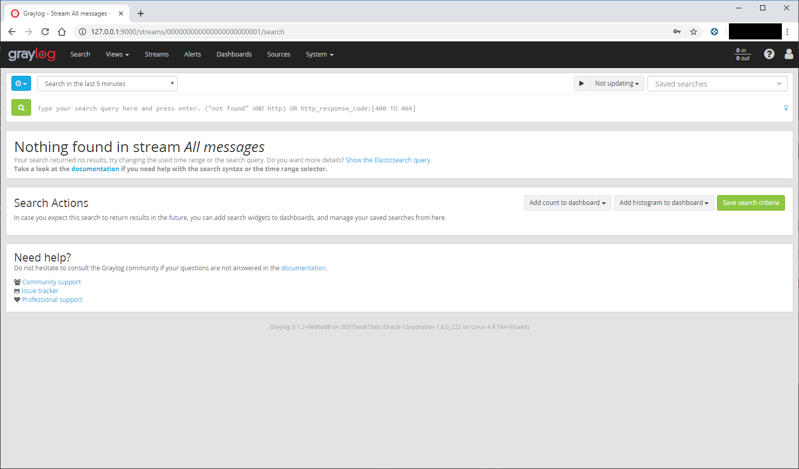
  </a>
</p>

From this view, you can filter the messages using the global search and to enable the auto update.

### Control Panel Stream

Inside the **Streams** section, using the button **Create Stream** we should be able to create a new **Stream** with a custom filter.

<p align="center">
  <a src='https://www.onesaitplatform.com/'>
    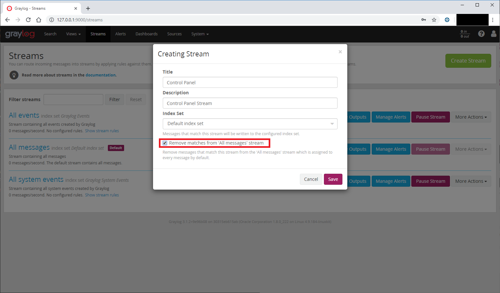
  </a>
</p>

We will use **Control Panel** as the title and will check the option **Remove matches from 'All messages' stream** (this option is optional). Then, press the **Save** button.

<p align="center">
  <a src='https://www.onesaitplatform.com/'>
    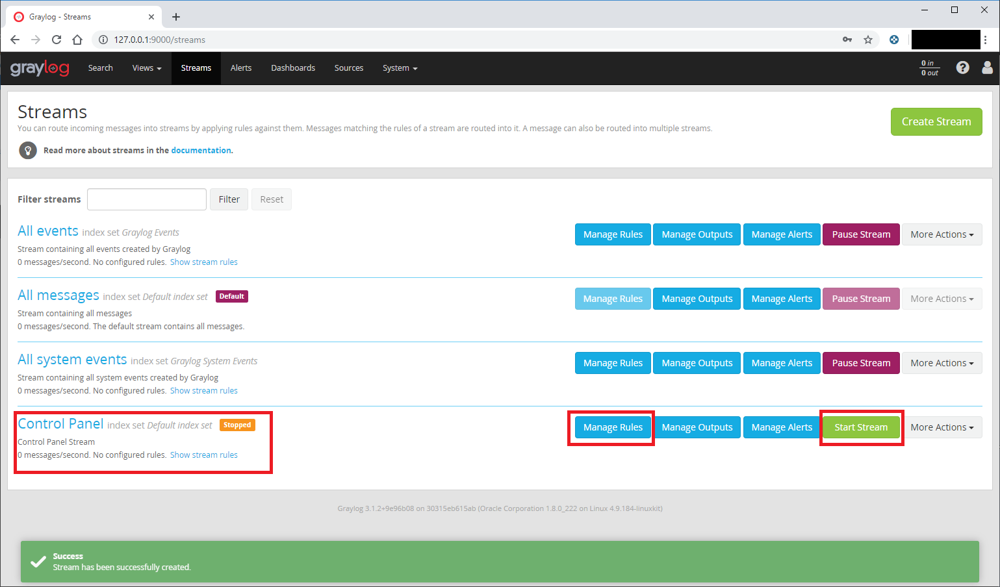
  </a>
</p>

The new stream was created successfully, but it is **Stopped**. We should **Manage the rules** and the press **Start Stream**.

<p align="center">
  <a src='https://www.onesaitplatform.com/'>
    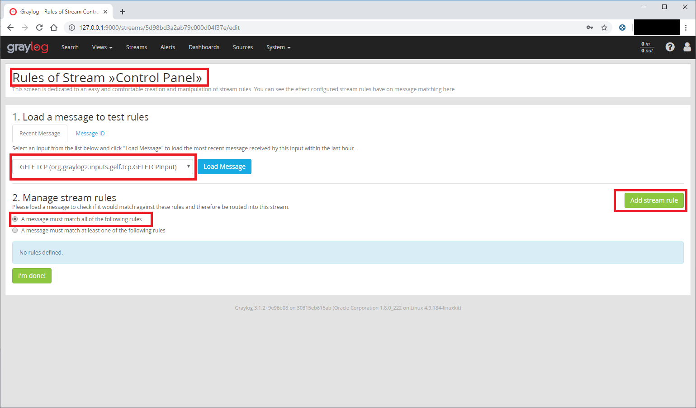
  </a>
</p>

Pressing the button **Manage rules** will open a new view. Inside this view, you should choose the **GELF TCP** as input for the rules. In the section **2. Manage stream rules**, check the radio **A message must match all of the following rules**. Then, press the button **Add stream rule**.

<p align="center">
  <a src='https://www.onesaitplatform.com/'>
    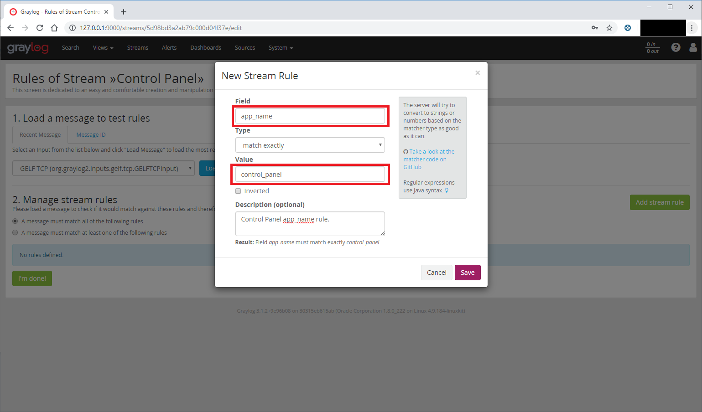
  </a>
</p>

The field should be **app_name** with the value **control_panel** This value is specified inside the spring-logback.xml file for every module and service.

```
  <appender name="GELF" class="com.minsait.onesait.platform.onelog.GelfTcpAppender">
      <encoder class="com.minsait.onesait.platform.onelog.GelfEncoder">
          <originHost>${HOSTNAME}</originHost>
          <staticField>app_name:${spring.application.name}</staticField>
          <staticField>os_name:${os.name}</staticField>
      </encoder>
  </appender>

  <appender name="ASYNC GELF" class="ch.qos.logback.classic.AsyncAppender">
      <appender-ref ref="GELF" />
  </appender>
```

Then, we should press the button **Save** to save the new rule.

<p align="center">
  <a src='https://www.onesaitplatform.com/'>
    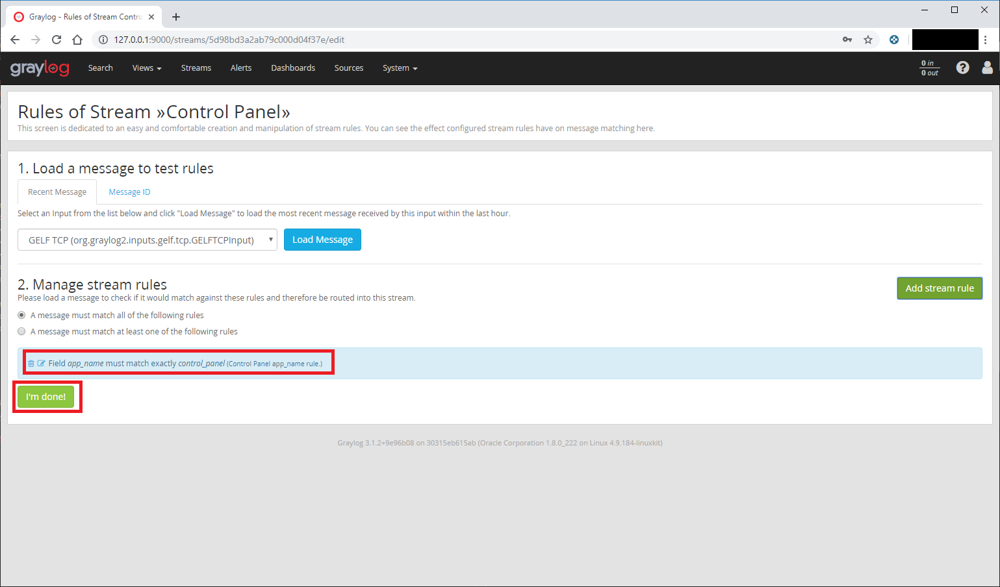
  </a>
</p>

We should be able to see the rule rule, the press the button **I'm done**.

<p align="center">
  <a src='https://www.onesaitplatform.com/'>
    
  </a>
</p>

Finally, we press the button **Start Stream** to start up the new Control Panel Stream

<p align="center">
  <a src='https://www.onesaitplatform.com/'>
    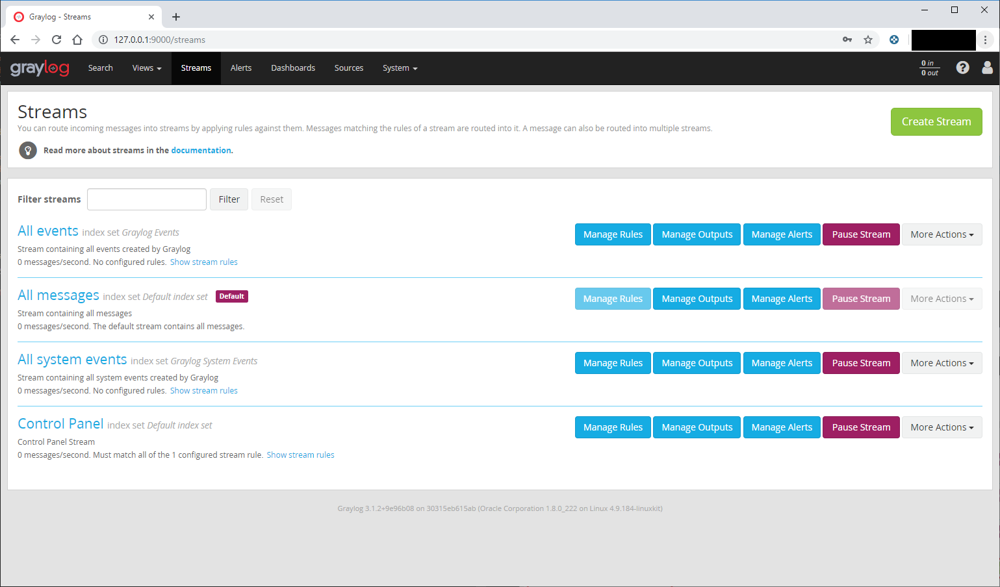
  </a>
</p>

If you enter inside of the **Control Panel stream** you can see all the logs from the Control Panel.

<p align="center">
  <a src='https://www.onesaitplatform.com/'>
    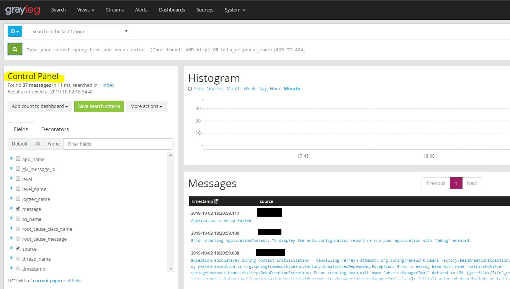
  </a>
</p>

## License

onesait Platform is Open Source software released under the [Apache Software License 2.0](http://www.apache.org/licenses/LICENSE-2.0).

See [`LICENSE`](LICENSE) and [`copyright.txt`](copyright.txt) for details.

