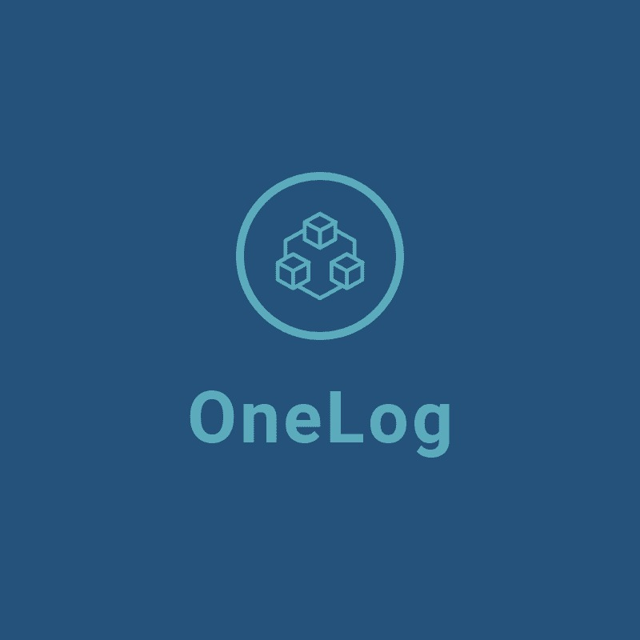

<p align="center">
  <a src='https://www.onesaitplatform.com/'>
    
  </a>
</p>
 
## OneLog project 
OneLog project is a centralized logging project using Graylog
<p align="center">
    
</p>


## Getting started with the platform 

The best way yo start with Onesait Platform is accesing our [Developer Portal](https://onesaitplatform.atlassian.net/wiki/spaces/OP/pages/45842643/Platform+Guides) where you can find a complete set of guides and tutorials.

For the quick start you can start watching one of the [Introductory Videos](https://onesaitplatform.atlassian.net/wiki/spaces/OP/pages/31424597/Introductory+Videos)
or perhaps you prefer to work with the Platform, then follow our [Getting Started Guide](https://onesaitplatform.atlassian.net/wiki/spaces/OP/pages/33179/Getting+Started)

## Graylog

To start up graylog, the best way it is using Docker [docker-compose file](https://github.com/onesaitplatform/onesaitplatform-revolution-onelog/blob/master/devops/build-deploy/docker/graylog/docker-compose.yml). Inside of the docker-compose file folder, use the following command:

```
  docker-compose up
```

After a while, you should be able to login in the Graylog dashboard using the [http://127.0.0.1:9000/](http://127.0.0.1:9000/).

<p align="center">
  <a src='https://www.onesaitplatform.com/'>
    
  </a>
</p>

The default user is **admin** with the password **admin**. You should change the default password in the user profile settings.

### Enable GELF TCP Input

The first step should be to enable the **GELF TCP input**, to be able to send logs from Onesait Platform modules. 
<p align="center">
  <a src='https://www.onesaitplatform.com/'>
    
  </a>
</p>

Select **System** > **Inputs**.

<p align="center">
  <a src='https://www.onesaitplatform.com/'>
    
  </a>
</p>

In the combo selector, choose **GELF TCP** and press the button **Launch new input**.

<p align="center">
  <a src='https://www.onesaitplatform.com/'>
    
  </a>
</p>

In the new modal window, **select the node** and enter the new **input title**. Then, scroll down and press the **Save** button.

<p align="center">
  <a src='https://www.onesaitplatform.com/'>
    
  </a>
</p>

The new GELF TCP input should now be up and running properly.

### Create the Control Panel stream

## License

onesait Platform is Open Source software released under the [Apache Software License 2.0](http://www.apache.org/licenses/LICENSE-2.0).

See [`LICENSE`](LICENSE) and [`copyright.txt`](copyright.txt) for details.

